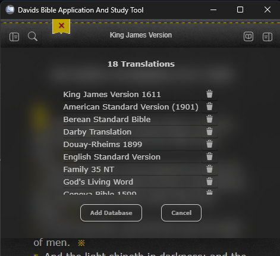

# DavidsBibleApp.github

A Tauri2 SolidJS App for Windows and Android

## Bible Translations (.dba)

This repository hosts Bible translations optimized for **Davids Bible App**.
These files use the `.dba` extension but are standard SQLite databases.

The Strongs and CrossRef use .db, and will not show up in the Translations installed, as they work with existing translations and need not be directly chosen. (Refresh, or reload, after installing to use)

## 📥 Download Instructions

### 1. Latest Versions

Applications for Windows (.msi) and Android (.apk, .aab) versions and future updates, visit our **[Releases Page](https://github.com/Davids-Bible-App/DavidsBibleApp.github/releases/latest)**.

### 2. Available Translations

| Language  | Lang | Translation                            | DownloadLink                                                                                                          |
| :-------- | :--- | :------------------------------------- | :-------------------------------------------------------------------------------------------------------------------- |
| English   | eng  | 21st Century King James Version (KJ21) | [Download](https://raw.githubusercontent.com/Davids-Bible-App/DavidsBibleApp.github/main/Translations/eng_kj21.dba)   |
| English   | eng  | American Standard Version (ASV)        | [Download](https://raw.githubusercontent.com/Davids-Bible-App/DavidsBibleApp.github/main/Translations/eng_asv.dba)    |
| English   | eng  | Berean Standard Bible (BSB)            | [Download](https://raw.githubusercontent.com/Davids-Bible-App/DavidsBibleApp.github/main/Translations/eng_bsb.dba)    |
| English   | eng  | Darby Translation (DBY)                | [Download](https://raw.githubusercontent.com/Davids-Bible-App/DavidsBibleApp.github/main/Translations/eng_dby.dba)    |
| English   | eng  | Douay-Rheims 1899 (DRA)                | [Download](https://raw.githubusercontent.com/Davids-Bible-App/DavidsBibleApp.github/main/Translations/eng_dra.dba)    |
| English   | eng  | English Standard Version (ESV)         | [Download](https://raw.githubusercontent.com/Davids-Bible-App/DavidsBibleApp.github/main/Translations/eng_esv.dba)    |
| English   | eng  | Family 35 New Testament (F35)          | [Download](https://raw.githubusercontent.com/Davids-Bible-App/DavidsBibleApp.github/main/Translations/eng_f35.dba)    |
| English   | eng  | Geneva Bible 1599 (GNV)                | [Download](https://raw.githubusercontent.com/Davids-Bible-App/DavidsBibleApp.github/main/Translations/eng_gnv.dba)    |
| English   | eng  | God's Living Word (GLW)                | [Download](https://raw.githubusercontent.com/Davids-Bible-App/DavidsBibleApp.github/main/Translations/eng_glw.dba)    |
| English   | eng  | King James Version (KJV)               | [Download](https://raw.githubusercontent.com/Davids-Bible-App/DavidsBibleApp.github/main/Translations/eng_kjv.dba)    |
| English   | eng  | King James Version (1611)              | [Download](https://raw.githubusercontent.com/Davids-Bible-App/DavidsBibleApp.github/main/Translations/eng_1611.dba)   |
| English   | eng  | NET Bible                              | [Download](https://raw.githubusercontent.com/Davids-Bible-App/DavidsBibleApp.github/main/Translations/eng_net.dba)    |
| English   | eng  | New International Version (NIV)        | [Download](https://raw.githubusercontent.com/Davids-Bible-App/DavidsBibleApp.github/main/Translations/eng_niv.dba)    |
| English   | eng  | World English Bible (WEB)              | [Download](https://raw.githubusercontent.com/Davids-Bible-App/DavidsBibleApp.github/main/Translations/eng_webp.dba)   |
| English   | eng  | Young's Literal Translation (YLT)      | [Download](https://raw.githubusercontent.com/Davids-Bible-App/DavidsBibleApp.github/main/Translations/eng_ylt.dba)    |
| Korean    | kor  | Korean Bible 1910 (OLD)                | [Download](https://raw.githubusercontent.com/Davids-Bible-App/DavidsBibleApp.github/main/Translations/kor_old.dba)    |
| Polish    | pol  | Biblica® Słowo Życia (OPLNT)           | [Download](https://raw.githubusercontent.com/Davids-Bible-App/DavidsBibleApp.github/main/Translations/pol_bib.dba)    |
| Polish    | pol  | Updated Gdansk Bible (UBG)             | [Download](https://raw.githubusercontent.com/Davids-Bible-App/DavidsBibleApp.github/main/Translations/pol_ubg.dba)    |
| Reference | -    | Cross-Reference Verses                 | [Download](https://raw.githubusercontent.com/Davids-Bible-App/DavidsBibleApp.github/main/Translations/cross_refs.db)  |
| Reference | -    | KJV Strongs Dictionary                 | [Download](https://raw.githubusercontent.com/Davids-Bible-App/DavidsBibleApp.github/main/Translations/strongs_kjv.db) |

## 🛠 How to Use

1. **Individual Files**: Click "Download" above for specific translations.
2. **Offline Backup**: Download the entire `Translations` folder to keep a local copy of all databases, Strongs Dictionary, and cross-references.
3. **.dba & .db File Installation**: Use the app's **Add Database** feature to import the `.dba` files. Click the Ribbon.
   
   - _Note: KJV Strongs data may require an app restart or refresh to initialize._

## 📄 License

MIT License - Copyright (c) 2026 Davids Bible App

---

_This is an automated storage repository for Davids Bible App._
